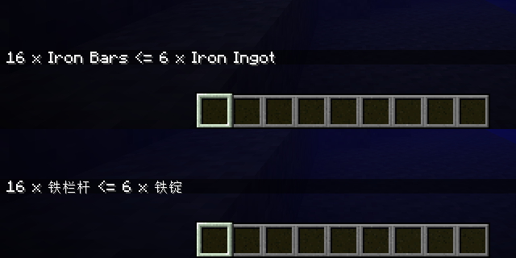

# 基本概念

以下是本篇指南所用到的基本概念。对部分 Minecraft 模组玩家和资源包 / 数据包创作者来说，一些概念可能已经相对熟悉了。

## 资源文件

Forge MDK 默认从 `src/main/resources` 和 `src/generated/resources` 检索资源文件，并几乎不加改动地复制到生成的模组文件中。

:::caution

`src/generated/resources` 存放的是 Data Generator 自动生成的文件，因此开发者不应该对其中的资源进行手动调整，而仅应通过启动 Data Generator 更新资源，或将自己的资源放置于 `src/main/resources` 目录下。

:::

除去 `pack.mcmeta` 和 `META-INF` 目录外，其他所有文件都应当位于 `assets` 和 `data` 目录下。

### `pack.mcmeta`

`pack.mcmeta` 是数据包和资源包共用的声明文件，为 [JSON 格式](https://www.json.org/json-zh.html)。以下为 `pack.mcmeta` 的一个示例：

```json
{
  "pack": {
    "pack_format": 8,
    "description": "Xiaozhong mod resources"
  }
}
```

:::tip

关于 `pack.mcmeta` 的具体格式，请参见 Minecraft Wiki 对[数据包](https://minecraft.fandom.com/zh/wiki/%E6%95%B0%E6%8D%AE%E5%8C%85)和[资源包](https://minecraft.fandom.com/zh/wiki/%E8%B5%84%E6%BA%90%E5%8C%85)的介绍。`pack_format` 指定了数据包和资源包的版本，对 Minecraft 1.18.x，其值为 `8`。

:::

### `META-INF/mods.toml`

通常情况下，所有 Forge 模组都需要在 `META-INF` 目录下指定一个 [TOML 格式](https://toml.io/cn/)的 `mods.toml` 文件。`mods.toml` 文件指定了模组的相关信息。

Forge MDK 默认提供的 `mods.toml` 以注释的形式为其提供了详尽的解释。以下为 `mods.toml` 的一个示例：

```toml
modLoader="javafml" # 模组所使用的加载器，此处固定
loaderVersion="[39,)" # 加载器版本号，通常和 Forge 的大版本号有关
license="All rights reserved" # 模组所采用的授权协议

[[mods]] # 模组本体信息
modId="xiaozhong" # 模组 ID
version="${file.jarVersion}" # 模组的版本号，此处固定
authors="TeaConMC" # 模组的作者，可在此填写自己的常用名称
displayName="Xiaozhong" # 模组名称，通常和 build.gradle 所写相同
description="The example mod for xiaozhong" # 模组的相关介绍，可以多行

[[dependencies.xiaozhong]] # 模组的相关依赖，通常会写上对 Forge 版本的依赖
modId="forge" # 相关依赖的模组 ID
mandatory=true # 相关依赖是否为必须
versionRange="[39,)" # 相关依赖的版本号范围
ordering="NONE" # 相关依赖和模组本体的加载顺序，也可以是 BEFORE 或 AFTER
side="BOTH" # 相关依赖是否一定要在玩家客户端或专用服务端出现，也可以是 CLIENT 或 SERVER
```

:::caution

模组开发者必须通过 `mods.toml` 指定一个协议，否则模组将无法启动。基于 TeaCon 的举办理念，我们鼓励模组开发者采用一个自由或开源的授权协议。

:::

### `assets` 和 `data`

 `assets` 和 `data` 目录下的资源分别对应资源包和数据包的资源。二类资源均拥有对应的[资源路径](https://minecraft.fandom.com/zh/wiki/%E5%91%BD%E5%90%8D%E7%A9%BA%E9%97%B4ID)。

:::caution

为方便起见，本篇指南的后续内容均将使用资源路径代指资源，如使用「`minecraft:item/compass` 处的模型文件」代指「名为 `assets/minecraft/models/item/compass.json` 的模型文件」。部分情况下，开发者引用的资源路径需补齐前缀和后缀（使用  `minecraft:textures/block/stone.png` 而非 `minecraft:block/stone`），我们会在类似情况出现时特殊说明，请各位读者加以注意。

:::

以下是 Minecraft 中的一些典型的资源类型：

| 资源性质 | 资源类型 | 资源前缀       | 资源后缀 | 示例                                                         |
| -------- | -------- | -------------- | -------- | ------------------------------------------------------------ |
| 资源包   | 模型     | `models/`      | `.json`  | 路径：`minecraft:item/compass`<br />文件：`assets/minecraft/models/item/compass.json` |
| 资源包   | 纹理     | `textures/`    | `.png`   | 路径：`minecraft:block/stone`<br />文件：`assets/minecraft/textures/block/stone.png` |
| 资源包   | 方块状态 | `blockstates/` | `.json`  | 路径：`minecraft:dirt`<br />文件：`assets/minecraft/blockstates/dirt.json` |
| 资源包   | 语言文件 | `lang/`        | `.json`  | 路径：`minecraft:zh_cn`<br />文件：`assets/minecraft/lang/zh_cn.json` |
| 数据包   | 配方     | `recipes/`     | `.json`  | 路径：`minecraft:bread`<br />文件：`data/minecraft/recipes/bread.json` |
| 数据包   | 战利品表 | `loot_tables/` | `.json`  | 路径：`minecraft:blocks/ice`<br />文件：`data/minecraft/loot_tables/blocks/ice.json` |

资源路径在源代码中为 `ResourceLocation`，如 `new ResourceLocation("foo", "bar")` 即代表 `foo:bar` 这一资源路径。命名空间如为 `minecraft` 则可省略（`new ResourceLocation("bar")` 代表 `minecraft:bar`）。

:::caution

模组 ID 是模组的唯一标识符，也应当是所有和模组相关的资源的[命名空间](https://minecraft.fandom.com/zh/wiki/%E5%91%BD%E5%90%8D%E7%A9%BA%E9%97%B4ID)：在管理资源时应当尽量使用模组 ID 作为命名空间。本篇指南所有新添加的资源均归属于 `xiaozhong` 命名空间。

:::

## Java 源代码

Forge MDK 默认从 `src/main/java` 检索 Java 源代码，将其编译并进行适当处理后封装到最终的模组文件中。

:::caution

源代码通常使用 UTF-8 作为文件编码，请调整开发工具的相关设置以确保编码正确性，并保证编译时所使用的编码也是正常的。后一个目标通常可以通过设置  `JAVA_TOOL_OPTIONS` 以及 `GRADLE_OPTS` 两个环境变量的值为 `-Dfile.encoding=UTF-8` 来达成。

:::

### 模组主类

通常情况下，所有 Forge 模组都需要在源代码中添加一个类作为模组主类。Forge MDK 默认内置了 `ExampleMod` 作为主类，实际开发时可将其修改为自己的主类，也可自行删去另建主类。

模组的主类需要使用 `@Mod` 注解标识，并在参数中声明模组 ID。以下是一个典型的主类：

```java
package org.teacon.xiaozhong;

import net.minecraftforge.fml.common.Mod;

@Mod("xiaozhong")
public class Xiaozhong {
    public Xiaozhong() {}
}
```

## 客户端和服务端

模组代码可能同时在两种不同类型的 Minecraft 下运行：一种是单人游玩或多人联机游玩时的玩家客户端，一种是开服时的专用服务端。Forge 使用 `Dist` 注解标记两种类型（分别是 `CLIENT` 和 `DEDICATED_SERVER`），并会将 `FMLEnvironment.dist` 标记为相应的值。

一些模组代码只会在 Minecraft 玩家客户端运行——Minecraft 本体也是如此。因此开发过程中有时能看到一些类的上方有 `@OnlyIn(Dist.CLIENT)` 标记。这些类只存在于玩家客户端，试图在专用服务端加载这些类将极易导致游戏抛出 `ClassNotFoundException`，进而导致游戏崩溃。

:::caution

**在专用服务端加载标有 `@OnlyIn(Dist.CLIENT)` 的类是模组开发的常见错误**，因开发者绝大多数时间只在玩家客户端测试模组，故无论是新手还是老手均难以避免。有两种办法可以尽力规避此事：一方面，在开发模组时有意识地将所有引用了标有 `@OnlyIn(Dist.CLIENT)` 的代码隔离到特定的类中，并加以特殊标记（如类名包含 `Client` 或位于 `client` 子包下）；另一方面，在最终发布前使用 `runServer` 启动选项检查专用服务端在添加模组后是否会崩溃。

:::

## 事件系统

模组的许多代码都是通过事件系统触发的。和大多数框架的事件系统一样，不同的事件归属于不同的事件总线。

Forge 的事件总线均为 `IEventBus` 接口的实例。模组开发者能够直接接触到的事件总线有两种：

* Forge 总线：一般处理游戏启动时能够触发的事件，可通过 `MinecraftForge.EVENT_BUS` 获得。
* 模组总线：一般处理游戏未启动时也会触发的事件，可通过 `FMLJavaModLoadingContext.get().getModEventBus()` 获得。

:::info

区分一个事件属于何种总线可以通过判断是否实现了 `IModBusEvent` 接口确定：实现了 `IModBusEvent` 接口的事件经由模组总线触发，否则经由 Forge 总线触发。

:::

### 注册监听器

模组开发者可通过直接调用事件总线的 `addListener` 方法注册监听器。以下为使用事件监听器注册玩家登录事件的例子：

```java
package org.teacon.xiaozhong;

import net.minecraft.Util;
import net.minecraft.network.chat.TextComponent;
import net.minecraftforge.api.distmarker.Dist;
import net.minecraftforge.common.MinecraftForge;
import net.minecraftforge.event.entity.player.PlayerEvent;
import net.minecraftforge.fml.common.Mod;
import net.minecraftforge.fml.loading.FMLEnvironment;

@Mod("xiaozhong")
public class Xiaozhong {
    public Xiaozhong() {
        // 通常在模组主类的构造方法注册事件监听器
        MinecraftForge.EVENT_BUS.addListener(PlayerLoggedInHandler::onLoggedIn);
        /*
        // 如果只希望在玩家客户端注册事件，请检查 FMLEnvironment.dist 的值
        if (FMLEnvironment.dist == Dist.CLIENT) {
            MinecraftForge.EVENT_BUS.addListener(PlayerLoggedInHandler::onLoggedIn);
        }
        */
    }

    public static class PlayerLoggedInHandler {
        public static void onLoggedIn(PlayerEvent.PlayerLoggedInEvent event) {
            // 检查到玩家登录后，向玩家发送一条「Welcome to xiaozhong!」的消息
            var player = event.getPlayer();
            player.sendMessage(new TextComponent("Welcome to xiaozhong!"), Util.NIL_UUID);
        }
    }
}
```

模组开发者也可通过 `@Mod.EventBusSubscriber` 注解自动注册。以下是一个使用该注解的例子，与上面的例子等价：

```java
package org.teacon.xiaozhong;

import net.minecraft.Util;
import net.minecraft.network.chat.TextComponent;
import net.minecraftforge.api.distmarker.Dist;
import net.minecraftforge.event.entity.player.PlayerEvent;
import net.minecraftforge.eventbus.api.SubscribeEvent;
import net.minecraftforge.fml.common.Mod;
import net.minecraftforge.fml.loading.FMLEnvironment;

@Mod("xiaozhong")
public class Xiaozhong {
    public Xiaozhong() {}

    // 所有自动注册监听器的类均需使用该注解标识
    // bus 为对应的事件总线，Bus.FORGE 为 Forge 总线，Bus.MOD 为模组总线
    @Mod.EventBusSubscriber(bus = Mod.EventBusSubscriber.Bus.FORGE)
    /*
    // 如果只希望在玩家客户端注册事件，请添加 value 参数
    @Mod.EventBusSubscriber(bus = Mod.EventBusSubscriber.Bus.FORGE, value = Dist.CLIENT)
    */
    public static class PlayerLoggedInHandler {
        // 监听器需为 public static 方法，并使用 @SubscribeEvent 注解
        // 监听器的方法名可自由选取，方法参数为对应的事件，在事件触发时作为参数传入
        @SubscribeEvent
        public static void onLoggedIn(PlayerEvent.PlayerLoggedInEvent event) {
            // 检查到玩家登录后，向玩家发送一条「Welcome to xiaozhong!」的消息
            var player = event.getPlayer();
            player.sendMessage(new TextComponent("Welcome to xiaozhong!"), Util.NIL_UUID);
        }
    }
}
```

## 文本与国际化

Minecraft 的所有用于展示的文本均为 `Component` 的实例。最常见的是 `TextComponent`。

开发中可以搭配 `withStyle` 和 `append` 方法调整文本的样式：

```java
player.sendMessage(new TextComponent("Welcome to xiaozhong!"), Util.NIL_UUID);
player.sendMessage(new TextComponent("Welcome to xiaozhong!").withStyle(ChatFormatting.GREEN), Util.NIL_UUID);
player.sendMessage(new TextComponent("Welcome to ").append(new TextComponent("xiaozhong").withStyle(ChatFormatting.GREEN)).append("!"), Util.NIL_UUID);
```


如果使用 `TextComponent`，则玩家无论选择了何种语言，看到的文字都是相同的。`TranslatableComponent` 可使文字在不同的语言下不同：

```java
var ironBars = new TranslatableComponent("block.minecraft.iron_bars");
var ironIngot = new TranslatableComponent("item.minecraft.iron_ingot");
player.sendMessage(new TextComponent("16 x ").append(ironBars).append(" <= 6 x ").append(ironIngot), Util.NIL_UUID);
```



:::info

如果使用 `TranslatableComponent`，则游戏会去寻找[语言文件](https://minecraft.fandom.com/zh/wiki/%E8%B5%84%E6%BA%90%E5%8C%85#.E8.AF.AD.E8.A8.80)中的翻译标识符并按照语言文件的规则翻译。如果翻译失败则游戏将直接显示翻译标识符本身。模组开发者也可以指定自己的语言文件，并放在 `[模组 ID]:[语言代码]` 亦即 `assets/[模组 ID]/lang/[语言代码].json` 处，常见的语言代码有 `en_us` 及 `zh_cn` 等。语言文件亦可使用 Data Generator 生成。

:::

:::caution

我们鼓励自定义的翻译标识符包含模组 ID 本身（如 `chat.xiaozhong.welcome` 便要比 `chat.welcome` 来得更好），以避免和其他模组或 Minecraft 原版定义的翻译标识符冲突。

:::

## Data Generator

Data Generator 是 Minecraft 原版提供的用于自动生成资源文件的机制。Forge 拓展了这一机制，以方便模组开发者从繁冗的 JSON 文件里解脱出来。

模组开发者需监听 `GatherDataEvent` 事件，并在监听器中添加自己的 `DataProvider`。该事件将在启动 Data Generator 后触发，并将自动生成的结果放入 `src/generated/resources` 中。

Minecraft 原版便提供了很多不同的 `DataProvider` 实例，Forge 还对其进行了扩展：如对应方块状态及模型的 `BlockStateProvider`，对应物品模型的 `ItemModelProvider`，对应语言文件的 `LanguageProvider` 等。模组开发者需继承它们，并覆盖对应的方法。

这里以语言文件的自动生成为例，演示 Data Generator 的相关代码：

```java
package org.teacon.xiaozhong;

import net.minecraft.Util;
import net.minecraft.data.DataGenerator;
import net.minecraft.network.chat.TranslatableComponent;
import net.minecraftforge.common.MinecraftForge;
import net.minecraftforge.common.data.LanguageProvider;
import net.minecraftforge.event.entity.player.PlayerEvent;
import net.minecraftforge.fml.common.Mod;
import net.minecraftforge.fml.javafmlmod.FMLJavaModLoadingContext;
import net.minecraftforge.forge.event.lifecycle.GatherDataEvent;

@Mod("xiaozhong")
public class Xiaozhong {
    public Xiaozhong() {
        MinecraftForge.EVENT_BUS.addListener(Xiaozhong::onLoggedIn);
        FMLJavaModLoadingContext.get().getModEventBus().addListener(Xiaozhong::onGatherData);
    }

    public static void onLoggedIn(PlayerEvent.PlayerLoggedInEvent event) {
        var player = event.getPlayer();
        // 发送一条 chat.xiaozhong.welcome 对应的消息
        // Data Generator 生成了含有 chat.xiaozhong.welcome 的语言文件
        player.sendMessage(new TranslatableComponent("chat.xiaozhong.welcome"), Util.NIL_UUID);
    }

    public static void onGatherData(GatherDataEvent event) {
        // Data Generator 启动时，该方法便会调用，新添加的 DataProvider 也开始工作
        // 从而在 src/generated/resources 下的 xiaozhong:en_us 和 xiaozhong:zh_cn 两处生成语言文件
        var gen = event.getGenerator();
        gen.addProvider(new EnglishLanguageProvider(gen));
        gen.addProvider(new ChineseLanguageProvider(gen));
    }

    // 英文语言文件
    public static class EnglishLanguageProvider extends LanguageProvider {
        public EnglishLanguageProvider(DataGenerator gen) {
            // 前三个参数分别是 Data Generator 本身，模组 ID，以及语言代码
            // 语言代码对应语言文件的资源路径，此处为 xiaozhong:en_us
            super(gen, "xiaozhong", "en_us");
        }

        @Override
        protected void addTranslations() {
            this.add("chat.xiaozhong.welcome", "Welcome to xiaozhong!");
        }
    }

    // 中文语言文件
    public static class ChineseLanguageProvider extends LanguageProvider {
        public ChineseLanguageProvider(DataGenerator gen) {
            // 前三个参数分别是 Data Generator 本身，模组 ID，以及语言代码
            // 语言代码对应语言文件的资源路径，此处为 xiaozhong:zh_cn
            super(gen, "xiaozhong", "zh_cn");
        }

        @Override
        protected void addTranslations() {
            this.add("chat.xiaozhong.welcome", "欢迎来到正山小种！");
        }
    }
}
```

:::caution

在更新了 Data Generator 相关代码后，模组开发者需及时通过 `runData` 重新运行 Data Generator，以更新 `src/generated/resources` 下的资源。

:::
