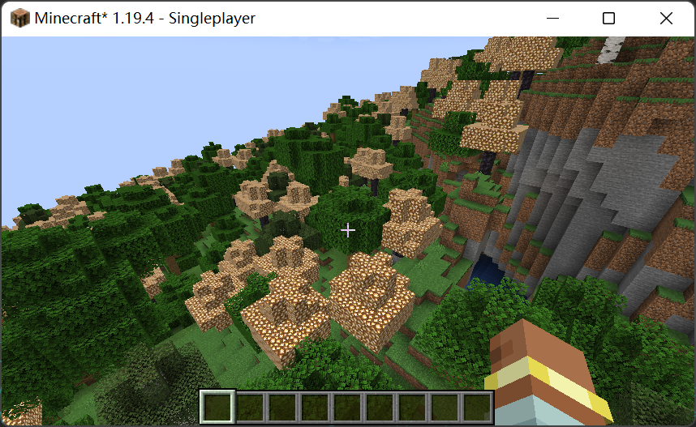

# 世界生成

<!-- markdownlint-disable MD033 -->

import Tabs from '@theme/Tabs'
import TabItem from '@theme/TabItem'
import CodeBlock from '@theme/CodeBlock'
import AddTree from '!!raw-loader!./xiaozhong/forge/biome_modifier/add_tree.a'
import CGoldTree from '!!raw-loader!./xiaozhong/worldgen/configured_feature/c_gold_tree.a'
import GoldTree from '!!raw-loader!./xiaozhong/worldgen/placed_feature/gold_tree.a'

Minecraft 将世界生成划分为了若干个阶段，其中模组开发者们经常关注的阶段有下列几个：

- 生物群系生成：游戏会在这一阶段中决定世界的每一个位置上都是什么生物群系。
- 地形生成：游戏会在这一阶段中决定世界的整体地势地貌。
- 地表生成：游戏会在这一阶段中根据生物群系等信息，为光秃秃的地表覆盖上一层「衣服」，例如沙漠的沙子、平原的草方块等
- 大型结构生成：游戏会在这一阶段中随机放置少量大型建筑（村庄、要塞、神殿、等）
- 地物生成：游戏会在这一阶段中随机放置小型的地表、地下装饰，如树木、竹子、大型蘑菇、晶洞、各类矿石等。

我们接下来将通过几个实例来说明「什么时候该用什么」。

## 生成矿物，树木，或是···

由于大部分地物都可以使用数据包定制，所以配置地物本身不再赘述，此处仅推荐一个[工具](https://misode.github.io/)用于制作地物。

可能已经有读者尝试过并感到一头雾水：怎么把他们加到已有的生物群系里而不是必须要重新写一个生物群系？

得益于使用的是 forge，我们可以使用 `net.minecraftforge.common.world.BiomeModifier` 对已有的生物群系进行更改,参照已有的实现类，我们将使用 `AddFeaturesBiomeModifier`。

他们将以这样的格式组织：

    xiaozhong
        ├─ forge
        │   └─ biome_modifier
        │       └─ add_tree.json
        └─ worldgen
            ├─ configured_feature
            │   └─ c_gold_tree.json
            └─ placed_feature
                └─ gold_tree.json

<Tabs>
<TabItem value="add_tree" label="add_tree">
    <CodeBlock language="json" metastring="{63,66-68,73-74,123-138,140-151}" showLineNumbers
               title="xiaozhong/forge/biome_modifier/add_tree.json">{AddTree}</CodeBlock>
</TabItem>
<TabItem value="c_gold_tree" label="c_gold_tree">
    <CodeBlock language="json" metastring="{63,66-68,73-74,123-138,140-151}" showLineNumbers
               title="xiaozhong/worldgen/configured_feature/c_gold_tree.json">{CGoldTree}</CodeBlock>
</TabItem>
<TabItem value="gold_tree" label="gold_tree">
    <CodeBlock language="json" metastring="{63,66-68,73-74,123-138,140-151}" showLineNumbers
               title="xiaozhong/worldgen/placed_feature/gold_tree.json">{GoldTree}</CodeBlock>
</TabItem>
</Tabs>

最终我们会在游戏内看到这样的内容：

