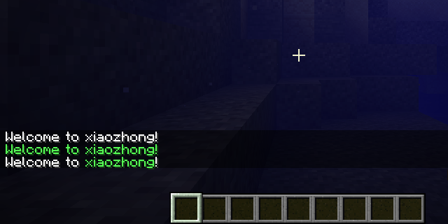
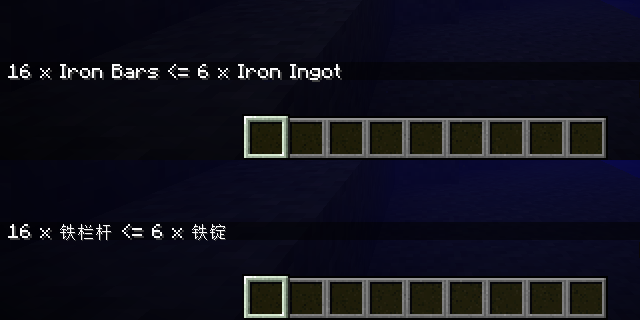

# 基本概念

<!-- markdownlint-disable MD033 -->

import Tabs from '@theme/Tabs'
import TabItem from '@theme/TabItem'
import CodeBlock from '@theme/CodeBlock'
import ModsToml from '!!raw-loader!./neoforge.mods.toml'
import EmptyXiaozhong from '!!raw-loader!./empty/Xiaozhong.java'
import ManualListenerXiaozhong from '!!raw-loader!./manual-listener/Xiaozhong.java'
import AutomaticListenerXiaozhong from '!!raw-loader!./automatic-listener/Xiaozhong.java'
import Xiaozhong from '!!raw-loader!./xiaozhong/Xiaozhong.java'

以下是本篇指南所用到的基本概念。对部分 Minecraft 模组玩家和资源包 / 数据包创作者来说，一些概念可能已经相对熟悉了。

## 资源文件

NeoForge MDK 默认从 `src/main/resources` 和 `src/generated/resources` 检索资源文件，并几乎不加改动地复制到生成的模组文件中。

:::caution

`src/generated/resources` 存放的是 Data Generator 自动生成的文件，因此开发者不应该对其中的资源进行手动调整，而仅应通过启动 Data Generator 更新资源，或将自己的资源放置于 `src/main/resources` 目录下。

:::

除去 `pack.mcmeta` 和 `META-INF` 目录外，其他所有文件都应当位于 `assets` 和 `data` 目录下。

### 咦，`pack.mcmeta` 不见了？

NeoForge 会为每一个模组自动生成和当前游戏版本对应的 `pack.mcmeta`，我们无需手动创建。

:::tip

关于 `pack.mcmeta` 的具体格式，请参见 Minecraft Wiki 对[数据包](https://zh.minecraft.wiki/w/%E6%95%B0%E6%8D%AE%E5%8C%85)和[资源包](https://zh.minecraft.wiki/w/%E8%B5%84%E6%BA%90%E5%8C%85)的介绍。

:::

### `META-INF/neoforge.mods.toml`

通常情况下，所有 NeoForge 模组都需要在 `META-INF` 目录下指定一个 [TOML 格式](https://toml.io/cn/)的 `neoforge.mods.toml` 文件。`neoforge.mods.toml` 文件指定了模组的相关信息。

NeoForge MDK 默认提供的 `neoforge.mods.toml` 以注释的形式为其提供了详尽的解释，同时 MDK 会把我们在上一节中 `gradle.properties` 填入的信息自动填入 `neoforge.mods.toml`，因此我们无需手动更改任何内容。

以下为 `mods.toml` 的一个示例：

<CodeBlock language="toml" title="src/main/resources/META-INF/neoforge.mods.toml" showLineNumbers>{ModsToml}</CodeBlock>

:::caution

模组开发者必须通过 `mods.toml` 指定一个协议，否则模组将无法启动。基于 TeaCon 的举办理念，我们鼓励模组开发者采用一个自由或开源的授权协议。

:::

### `assets` 和 `data`

 `assets` 和 `data` 目录下的资源分别对应资源包和数据包的资源。二类资源均拥有对应的[资源路径](https://zh.minecraft.wiki/w/%E5%91%BD%E5%90%8D%E7%A9%BA%E9%97%B4ID)。

:::caution

为方便起见，本篇指南的后续内容均将使用资源路径代指资源，如使用「`minecraft:item/compass` 处的模型文件」代指「名为 `assets/minecraft/models/item/compass.json` 的模型文件」。部分情况下，开发者引用的资源路径需补齐前缀和后缀（使用  `minecraft:textures/block/stone.png` 而非 `minecraft:block/stone`），我们会在类似情况出现时特殊说明，请各位读者加以注意。

:::

以下是 Minecraft 中的一些典型的资源类型：

| 资源性质 | 资源类型 | 资源前缀       | 资源后缀 | 示例                                                         |
| -------- | -------- | -------------- | -------- | ------------------------------------------------------------ |
| 资源包   | 模型     | `models/`      | `.json`  | 路径：`minecraft:item/compass`<br />文件：`assets/minecraft/models/item/compass.json` |
| 资源包   | 纹理     | `textures/`    | `.png`   | 路径：`minecraft:block/stone`<br />文件：`assets/minecraft/textures/block/stone.png` |
| 资源包   | 方块状态 | `blockstates/` | `.json`  | 路径：`minecraft:dirt`<br />文件：`assets/minecraft/blockstates/dirt.json` |
| 资源包   | 语言文件 | `lang/`        | `.json`  | 路径：`minecraft:zh_cn`<br />文件：`assets/minecraft/lang/zh_cn.json` |
| 数据包   | 配方     | `recipe/`     | `.json`  | 路径：`minecraft:bread`<br />文件：`data/minecraft/recipe/bread.json` |
| 数据包   | 战利品表 | `loot_table/` | `.json`  | 路径：`minecraft:blocks/ice`<br />文件：`data/minecraft/loot_table/blocks/ice.json` |

资源路径在源代码中为 `ResourceLocation`，如 `ResourceLocation.fromNamespaceAndPath("foo", "bar")` 即代表 `foo:bar` 这一资源路径。

命名空间如为 `minecraft` 则可使用 `ResourceLocation.withDefaultNamespace("bar")`，代表 `minecraft:bar`。

:::caution

模组 ID 是模组的唯一标识符，也应当是所有和模组相关的资源的[命名空间](https://zh.minecraft.wiki/w/%E5%91%BD%E5%90%8D%E7%A9%BA%E9%97%B4ID)：在管理资源时应当尽量使用模组 ID 作为命名空间。本篇指南所有新添加的资源均归属于 `xiaozhong` 命名空间。

:::

## Java 源代码

NeoForge MDK 默认从 `src/main/java` 检索 Java 源代码，将其编译并进行适当处理后封装到最终的模组文件中。

:::caution

源代码通常使用 UTF-8 作为文件编码，请调整开发工具的相关设置以确保编码正确性，并保证编译时所使用的编码也是正常的。后一个目标通常可以通过设置  `JAVA_TOOL_OPTIONS` 以及 `GRADLE_OPTS` 两个环境变量的值为 `-Dfile.encoding=UTF-8` 来达成。

:::

### 模组主类

通常情况下，所有 NeoForge 模组都需要在源代码中添加一个类作为模组主类。NeoForge MDK 默认内置了 `ExampleMod` 作为主类，实际开发时可将其修改为自己的主类，也可自行删去另建主类。

模组的主类需要使用 `@Mod` 注解标识，并在参数中声明模组 ID。以下是一个典型的主类：

<CodeBlock language="java" title="src/main/java/org/teacon/xiaozhong/Xiaozhong.java" showLineNumbers>{EmptyXiaozhong}</CodeBlock>

## 客户端和服务端

模组代码可能同时在两种不同类型的 Minecraft 下运行：一种是单人游玩或多人联机游玩时的玩家客户端，一种是开服时的专用服务端。NeoForge 使用 `Dist` 注解标记两种类型（分别是 `CLIENT` 和 `DEDICATED_SERVER`），并会将 `FMLEnvironment.dist` 标记为相应的值。

一些模组代码只会在 Minecraft 玩家客户端运行——Minecraft 本体也是如此。因此开发过程中有时能看到一些类的上方有 `@OnlyIn(Dist.CLIENT)` 标记。这些类只存在于玩家客户端，试图在专用服务端加载这些类将极易导致游戏抛出 `ClassNotFoundException`，进而导致游戏崩溃。

:::caution

**在专用服务端加载标有 `@OnlyIn(Dist.CLIENT)` 的类是模组开发的常见错误**，因开发者绝大多数时间只在玩家客户端测试模组，故无论是新手还是老手均难以避免。

有两种办法可以尽力规避此事：一方面，在开发模组时有意识地将所有引用了标有 `@OnlyIn(Dist.CLIENT)` 的代码隔离到特定的类中，并加以特殊标记（如类名包含 `Client` 或位于 `client` 子包下）；另一方面，在最终发布前使用 `runServer` 启动选项检查专用服务端在添加模组后是否会崩溃。

此外，NeoForge 还允许你在 `@Mod` 注解标识中指定「这个模组主类应在哪个地方运行」。

:::

## 事件系统

模组的许多代码都是通过事件系统触发的。和大多数框架的事件系统一样，不同的事件归属于不同的事件总线。

NeoForge 的事件总线均为 `IEventBus` 接口的实例。模组开发者能够直接接触到的事件总线有两种：

* NeoForge 总线：一般处理游戏启动时能够触发的事件，可通过 `NeoForge.EVENT_BUS` 获得。
* 模组总线：一般处理游戏未启动时也会触发的事件，可通过在模组主类构造器中额外声明一 `IEventBus` 参数获得。

:::info

区分一个事件属于何种总线可以通过判断是否实现了 `IModBusEvent` 接口确定：实现了 `IModBusEvent` 接口的事件经由模组总线触发，否则经由 NeoForge 总线触发。

:::

### 注册监听器

模组开发者可通过直接调用事件总线的 `addListener` 方法注册监听器。以下为使用事件监听器注册玩家登录事件的例子：

<Tabs>
<TabItem value="core" label="核心代码">

```java title="src/main/java/org/teacon/xiaozhong/Xiaozhong.java"
// 通常在模组主类的构造方法注册事件监听器
NeoForge.EVENT_BUS.addListener(PlayerLoggedInHandler::onLoggedIn);
/*
// 如果只希望在玩家客户端注册事件，请检查 FMLEnvironment.dist 的值
if (FMLEnvironment.dist == Dist.CLIENT) {
    NeoForge.EVENT_BUS.addListener(PlayerLoggedInHandler::onLoggedIn);
}
*/

public static class PlayerLoggedInHandler {
    public static void onLoggedIn(PlayerEvent.PlayerLoggedInEvent event) {
        // 检查到玩家登录后，向玩家发送一条「Welcome to xiaozhong!」的消息
        var player = event.getEntity();
        player.sendSystemMessage(Component.literal("Welcome to xiaozhong!"));
    }
}
```

</TabItem>
<TabItem value="full" label="完整代码">
    <CodeBlock language="java" metastring="{11,15-18}" showLineNumbers
               title="src/main/java/org/teacon/xiaozhong/Xiaozhong.java">{ManualListenerXiaozhong}</CodeBlock>
</TabItem>
</Tabs>

模组开发者也可通过 `@EventBusSubscriber` 注解自动注册。以下是一个使用该注解的例子，与上面的例子等价：

<Tabs>
<TabItem value="core" label="核心代码">

```java title="src/main/java/org/teacon/xiaozhong/Xiaozhong.java"
// 为监听器的外部类添加 @EventBusSubscriber 注解
@EventBusSubscriber(bus = EventBusSubscriber.Bus.GAME)
/*
// 如果只希望在玩家客户端注册事件，请添加 value 参数
@EventBusSubscriber(bus = EventBusSubscriber.Bus.GAME, value = Dist.CLIENT)
*/
public static class PlayerLoggedInHandler {
    // 监听器需为 public static 方法，并使用 @SubscribeEvent 注解
    // 监听器的方法名可自由选取，方法参数为对应的事件，在事件触发时作为参数传入
    @SubscribeEvent
    public static void onLoggedIn(PlayerEvent.PlayerLoggedInEvent event) {
        // 检查到玩家登录后，向玩家发送一条「Welcome to xiaozhong!」的消息
        var player = event.getEntity();
        player.sendSystemMessage(Component.literal("Welcome to xiaozhong!"));
    }
}
```

</TabItem>
<TabItem value="full" label="完整代码">
    <CodeBlock language="java" metastring="{13-20}" showLineNumbers
               title="src/main/java/org/teacon/xiaozhong/Xiaozhong.java">{AutomaticListenerXiaozhong}</CodeBlock>
</TabItem>
</Tabs>

## 文本与国际化

Minecraft 的所有用于展示的文本均为 `Component` 的实例。

此外，还有可以修改内容的 `MutableComponent`，可以搭配 `withStyle` 和 `append` 方法调整文本的样式：

```java
player.sendSystemMessage(Component.literal("Welcome to xiaozhong!"));
player.sendSystemMessage(Component.literal("Welcome to xiaozhong!").withStyle(ChatFormatting.GREEN));
player.sendSystemMessage(Component.literal("Welcome to ").append(Component.literal("xiaozhong").withStyle(ChatFormatting.GREEN)).append("!"));
```



如果使用 `Component.literal`，则玩家无论选择了何种语言，看到的文字都是相同的。`Component.translatable` 可使文字在不同的语言下不同：

```java
var ironBars = Component.translatable("block.minecraft.iron_bars");
var ironIngot = Component.translatable("item.minecraft.iron_ingot");
player.sendSystemMessage(Component.literal("16 x ").append(ironBars).append(" <= 6 x ").append(ironIngot));
```



:::info

如果使用 `Component.translatable`，则游戏会去寻找[语言文件](https://zh.minecraft.wiki/w/%E8%B5%84%E6%BA%90%E5%8C%85#.E8.AF.AD.E8.A8.80)中的翻译标识符并按照语言文件的规则翻译。如果翻译失败则游戏将直接显示翻译标识符本身。模组开发者也可以指定自己的语言文件，并放在 `[模组 ID]:[语言代码]` 亦即 `assets/[模组 ID]/lang/[语言代码].json` 处，常见的语言代码有 `en_us` 及 `zh_cn` 等。语言文件亦可使用 Data Generator 生成。

:::

:::caution

我们鼓励自定义的翻译标识符包含模组 ID 本身（如 `chat.xiaozhong.welcome` 便要比 `chat.welcome` 来得更好），以避免和其他模组或 Minecraft 原版定义的翻译标识符冲突。

:::

## Data Generator

Data Generator 是 Minecraft 原版提供的用于自动生成资源文件的机制。NeoForge 拓展了这一机制，以方便模组开发者从繁冗的 JSON 文件里解脱出来。

模组开发者需监听 `GatherDataEvent` 事件，并在监听器中添加自己的 `DataProvider`。该事件将在启动 Data Generator 后触发，并将自动生成的结果放入 `src/generated/resources` 中。

Minecraft 原版便提供了很多不同的 `DataProvider` 实例，NeoForge 还对其进行了扩展：如对应方块状态及模型的 `BlockStateProvider`，对应物品模型的 `ItemModelProvider`，对应语言文件的 `LanguageProvider` 等。模组开发者需继承它们，并覆盖对应的方法。

这里以语言文件的自动生成为例，演示 Data Generator 的相关代码：

<Tabs>
<TabItem value="core" label="核心代码">

```java title="src/main/java/org/teacon/xiaozhong/Xiaozhong.java"
// 添加监听器
NeoForge.EVENT_BUS.addListener(Xiaozhong::onLoggedIn);
modEventBus.addListener(Xiaozhong::onGatherData);

public static void onLoggedIn(PlayerEvent.PlayerLoggedInEvent event) {
    var player = event.getEntity();
    // 发送一条 chat.xiaozhong.welcome 对应的消息
    // Data Generator 生成了含有 chat.xiaozhong.welcome 的语言文件
    player.sendSystemMessage(Component.translatable("chat.xiaozhong.welcome"));
}

public static void onGatherData(GatherDataEvent event) {
    // Data Generator 启动时，该方法便会调用，新添加的 DataProvider 也开始工作
    // 从而在 src/generated/resources 下的 xiaozhong:en_us 和 xiaozhong:zh_cn 两处生成语言文件
    var gen = event.getGenerator();
    var packOutput = gen.getPackOutput();
    gen.addProvider(event.includeClient(), new EnglishLanguageProvider(packOutput));
    gen.addProvider(event.includeClient(), new ChineseLanguageProvider(packOutput));
}

// 英文语言文件
public static class EnglishLanguageProvider extends LanguageProvider {
    public EnglishLanguageProvider(PackOutput packOutput) {
        // 前三个参数分别是 Data Generator 本身，模组 ID，以及语言代码
        // 语言代码对应语言文件的资源路径，此处为 xiaozhong:en_us
        super(packOutput, "xiaozhong", "en_us");
    }

    @Override
    protected void addTranslations() {
        this.add("chat.xiaozhong.welcome", "Welcome to xiaozhong!");
    }
}

// 中文语言文件
public static class ChineseLanguageProvider extends LanguageProvider {
    public ChineseLanguageProvider(PackOutput packOutput) {
        // 前三个参数分别是 Data Generator 本身，模组 ID，以及语言代码
        // 语言代码对应语言文件的资源路径，此处为 xiaozhong:zh_cn
        super(packOutput, "xiaozhong", "zh_cn");
    }

    @Override
    protected void addTranslations() {
        this.add("chat.xiaozhong.welcome", "欢迎来到正山小种！");
    }
}
```

</TabItem>
<TabItem value="full" label="完整代码">
    <CodeBlock language="java" metastring="{16-17,20-23,25-30,32-41,43-52}" showLineNumbers
               title="src/main/java/org/teacon/xiaozhong/Xiaozhong.java">{Xiaozhong}</CodeBlock>
</TabItem>
</Tabs>

:::caution

在更新了 Data Generator 相关代码后，模组开发者需及时通过 `runData` 重新运行 Data Generator，以更新 `src/generated/resources` 下的资源。

:::
