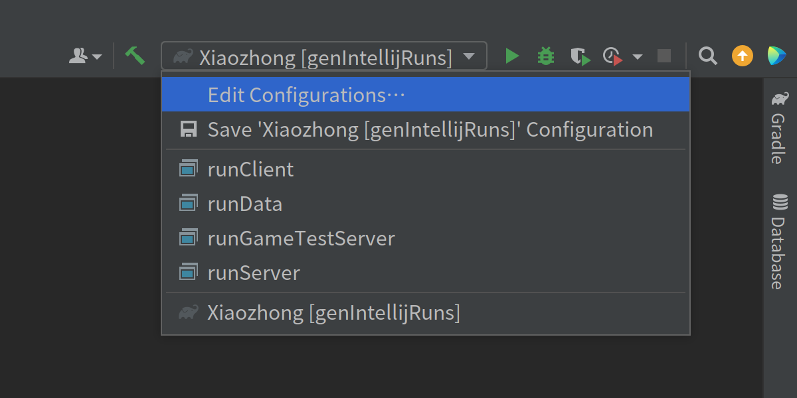

# 准备工作

<!-- markdownlint-disable MD033 -->

import Tabs from '@theme/Tabs'
import TabItem from '@theme/TabItem'
import CodeBlock from '@theme/CodeBlock'
import GradleProperties from '!!raw-loader!./gradle.properties'

除去必要的硬件条件外，读者需要从 <https://github.com/NeoForgeMDKs/MDK-1.21-ModDevGradle> 下载模组开发套件（Mod Development Kit，简称 MDK）。


如果你下载的是形如 `MDK-1.21-ModDevGradle-main.zip` 的完整文件，那么恭喜你，下载成功了：找个合适的地方解压这个压缩包吧。

:::tip
下载 MDK 有困难的读者可以考虑[点这里](./MDK-1.21-ModDevGradle-main.zip)下载。
:::

## 模组 ID

除去一个帅气的模组名称外，每个模组都需要一个全局唯一的模组 ID。

:::caution

模组 ID 应当仅由数字（`0-9`）、小写字母（`a-z`）、和下划线（`_`）组成，最长 63 个字符，且尽量避免冲突：`industrialcraft2` 或者 `industrial_craft_2` 作为模组 ID 看起来就比 `ic2` 好很多（当然，如果你是 `ic2` 的作者，那当我没说）。

:::

本篇指南的模组 ID 统一使用 `xiaozhong`。

## 配置文件

NeoForge MDK 的配置文件是 `build.gradle` 和 `gradle.properties`。

对 Gradle 熟悉的读者应该注意到了这些是 Gradle 的核心配置文件。

:::tip

如欲进一步了解 Gradle，可参阅 [Gradle 官方用户指南](https://docs.gradle.org/current/userguide/userguide.html)。此外，Gradle 还提供了使用 Kotlin 编写构建脚本的支持，如欲进一步了解，可参阅 [Gradle Kotlin DSL 入门](https://docs.gradle.org/current/userguide/kotlin_dsl.html#kotlin_dsl)以及本篇指南的[使用 Kotlin 配置项目](#使用-kotlin-配置项目)一节。

:::

主要需要修改的地方只有一处：`gradle.properties`。

<Tabs>
<TabItem value="core" label="核心代码">

```properties title="gradle.properties"
# Minecraft 官方对源代码编译后进行了混淆，因此为还原方法名、字段名、类名、以及包名以方便模组开发，NeoForge MDK 需要参照一个映射表。
# 官方映射表未包含变量名的相关数据，而一个名叫「Parchment」的项目正好填补了这一空白。
# NeoForge MDK 默认会自动使用 Parchment 提供的数据，我们则需要在这里指定 Parchment 的版本号。
parchment_minecraft_version=1.21
parchment_mappings_version=2024.06.23
# Environment Properties
# You can find the latest versions here: https://projects.neoforged.net/neoforged/neoforge
# The Minecraft version must agree with the Neo version to get a valid artifact
minecraft_version=1.21
# The Minecraft version range can use any release version of Minecraft as bounds.
# Snapshots, pre-releases, and release candidates are not guaranteed to sort properly
# as they do not follow standard versioning conventions.
minecraft_version_range=[1.21,1.21.1)
# The Neo version must agree with the Minecraft version to get a valid artifact
neo_version=21.0.61-beta
# The Neo version range can use any version of Neo as bounds
neo_version_range=[21.0.61-beta,)
# The loader version range can only use the major version of FML as bounds
loader_version_range=[4,)

# 模组的唯一识别 ID，必须和 @Mod（后面会提到）中填入的 ID 相同。
# 关于模组 ID 的要求，请参考上文。
mod_id=xiaozhong
# 模组的大名。
mod_name=正山小种
# 模组的授权协议，默认为 ARR，即用户无权使用你的模组做任何事。
# 您可以在 https://choosealicense.com/ 了解更多可能的选项。
# 我们建议您在这里使用 SPDX 收录的许可证代码，以方便机器自动识别。
mod_license=All Rights Reserved
# 模组版本号。我们在此建议使用语义化版本（Semantic Versioning）。
# 关于语义化版本的更多信息，可参考：https://semver.org/
mod_version=1.0.0
# 模组的 Maven 组名，通常和包名相同。
# 扩展阅读：https://maven.apache.org/guides/mini/guide-naming-conventions.html
mod_group_id=org.teacon.xiaozhong
# 模组作者列表
mod_authors=YourNameHere, OtherNameHere
# 模组简介。你可以使用 \n 表示换行。
mod_description=Example mod description.\nNewline characters can be used and will be replaced properly.
```

</TabItem>
<TabItem value="full" label="完整代码">
    <CodeBlock language="properties" metastring="{14-16}" title="gradle.properties" showLineNumbers>{GradleProperties}</CodeBlock>
</TabItem>
</Tabs>


配置文件修改完成后，将 `build.gradle` 所在目录使用文本编辑器或 IDE 打开，等待进度条加载完成即可。

:::info

NeoForge 官方倾向于支持的开发工具有：Eclipse、IntelliJ IDEA、和 Visual Studio Code。我们鼓励使用 IntelliJ IDEA（<https://www.jetbrains.com/idea/>）作为开发工具。

:::

:::caution

文本编辑器或 IDE 会自动完成全部配置（对 IntelliJ IDEA 而言进度会在 Build 侧边栏显示），但如果网络环境欠佳，配置进度将会十分缓慢，甚至可能出错。

如果反复尝试均无法配置成功，可尝试删除**用户根目录**的 `.gradle` 目录重试。

:::

## MDK 任务

Gradle 是一个基于任务的项目管理系统。通过 NeoForge MDK 我们可以执行许多不同的 Gradle 任务，但最常用的任务如下：

* `clean`：清理和 NeoForge MDK 有关的自动生成的部分文件。
* `build`：生成模组文件（生成的文件可在 `build/libs` 找到，可用于发布）。

### 启动选项

NeoForge MDK 会为我们自动生成四套启动选项。其中：

- `runClient` 用于启动 Minecraft 玩家客户端
- `runServer` 用于启动专用服务端
- `runGameTestServer` 用于游戏测试
- `runData` 则用于启动 Data Generator。

:::info

Data Generator 是 Minecraft 原版的一种机制，可以用于自动生成资源文件。

我们[稍后](./concepts#data-generator)会用到 Data Generator 这一机制。

:::

常见的开发工具均深度集成了 Gradle 的支持（或有对应的插件），无论是执行 Gradle 任务还是通过启动选项启动乃至调试游戏均可在开发工具内部进行。

:::tip

IntelliJ IDEA 用户可打开 Gradle 侧边栏，并在 `Tasks` 下找到上述任务并双击执行。在 IntelliJ IDEA 执行 `genIntellijRuns` 任务后，右上角便会出现四个相应的启动选项。



:::

## 使用 Kotlin 配置项目

*即将到来*