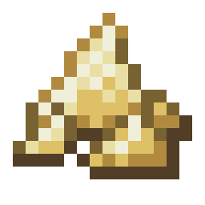
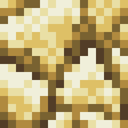
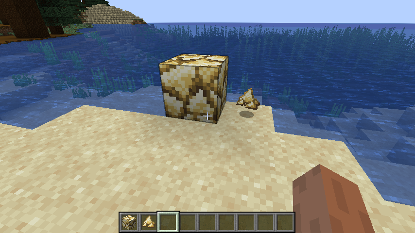

# 方块和物品

import Tabs from '@theme/Tabs'
import TabItem from '@theme/TabItem'
import CodeBlock from '@theme/CodeBlock'
import SimpleXiaozhong from '!!raw-loader!./simple/Xiaozhong.java'
import Xiaozhong from '!!raw-loader!./xiaozhong/Xiaozhong.java'

Minecraft 中不同的方块类型或物品类型对应不同的实例：方块类型对应 `Block` 类，物品类型对应 `Item` 类。开发者可直接使用这两个类构造方块类型或物品类型，也可继承它们，实现自己的方块类或物品类。

一个值得注意的物品类是 `BlockItem` 类：它是 `Item` 的子类，用于代表方块对应的物品。`BlockItem` 实现了作为方块的物品需要实现的特性——右键放置方块，因此在声明 `Block` 时通常会一并声明其对应的 `BlockItem`。

## 方块和物品属性

`Block` 和 `Item` 的构造方法均需传入相应的 `Properties`（方块是 `BlockBehavior.Properties`，物品是 `Item.Properties`）。

你可以通过方块的 `Properties` 来指定方块本身的[硬度](https://zh.minecraft.wiki/w/%E6%8C%96%E6%8E%98#.E6.96.B9.E5.9D.97.E7.A1.AC.E5.BA.A6)及[爆炸抗性](https://zh.minecraft.wiki/w/%E7%88%86%E7%82%B8#.E7.88.86.E7.82.B8.E6.8A.97.E6.80.A7)（`strength`）、是否可徒手破坏掉落（`requiresCorrectToolForDrops`）、亮度（`lightLevel`）等。物品的 `Properties` 有一些额外方法可以指定物品的最大堆叠（`stacksTo`）、合成后剩余的物品（`craftRemainder`）等。

```java
// 一个普通的物品
var item = new Item(new Item.Properties());
// 一个属性和原版石头一致，但需要特定工具挖掘掉落，且方块硬度为 2，爆炸抗性为 1.5 的方块
var block = new Block(BlockBehaviour.Properties.ofFullCopy(Blocks.STONE).requiresCorrectToolForDrops().strength(2F, 1.5F));
// 一个与上述方块对应的物品
var blockItem = new BlockItem(block, new Item.Properties());
```

:::tip

可以通过查看 `Blocks` 及 `Items` 类（注意类名最后的 `s`）了解原版方块及物品的相关属性。

:::

## 注册系统

NeoForge 并未接管原版的注册表，因此我们应使用原版注册表注册新游戏元素，然而该过程极易出错。

NeoForge 为我们提供了 `DeferredRegister` 方便我们向 Minecraft 中注册游戏元素。在此基础上，NeoForge 还提供了快速创建方块和物品的 `DeferredRegister` 的方式，在此我们将展示如何使用。

<Tabs>
<TabItem value="core" label="核心代码">

```java title="src/main/java/org/teacon/xiaozhong/Xiaozhong.java"
// 为 xiaozhong 命名空间注册物品
public static final DeferredRegister<Item> ITEMS = DeferredRegister.Items.createItems("xiaozhong");
```

</TabItem>
<TabItem value="full" label="完整代码">
    <CodeBlock language="java" metastring="{15}" showLineNumbers
               title="src/main/java/org/teacon/xiaozhong/Xiaozhong.java">{SimpleXiaozhong}</CodeBlock>
</TabItem>
</Tabs>

`DeferredRegister` 有两个名为 `register` 的重载方法。一个需传入游戏元素的 ID 和相应的 `Supplier`，用于注册相应的实例：

<Tabs>
<TabItem value="core" label="核心代码">

```java title="src/main/java/org/teacon/xiaozhong/Xiaozhong.java"
// xiaozhong:sulfur_dust 对应的物品
public static final String SULFUR_DUST_ID = "sulfur_dust";
public static final DeferredHolder<Item, Item> SULFUR_DUST_ITEM;

// 注册物品实例
SULFUR_DUST_ITEM = ITEMS.register(SULFUR_DUST_ID,
        () -> new Item(new Item.Properties()));
```

</TabItem>
<TabItem value="full" label="完整代码">
    <CodeBlock language="java" metastring="{18-19,26-27}" showLineNumbers
               title="src/main/java/org/teacon/xiaozhong/Xiaozhong.java">{SimpleXiaozhong}</CodeBlock>
</TabItem>
</Tabs>

:::info

`DeferredHolder` 储存着游戏元素的实例——该实例可通过 `get` 方法获得。建议将物品和方块对应的 `DeferredHolder` 以静态字段的方式声明。

:::

`DeferredRegister` 的另一个 `register` 方法需传入 `IEventBus`，用于完成具体的注册（通常在主类的构造方法调用）：

<Tabs>
<TabItem value="core" label="核心代码">

```java title="src/main/java/org/teacon/xiaozhong/Xiaozhong.java"
// 注册所有物品
ITEMS.register(modEventBus);
```

</TabItem>
<TabItem value="full" label="完整代码">
    <CodeBlock language="java" metastring="{35}" showLineNumbers
               title="src/main/java/org/teacon/xiaozhong/Xiaozhong.java">{SimpleXiaozhong}</CodeBlock>
</TabItem>
</Tabs>

:::info

将 `IEventBus` 传入 `register` 方法本质上是为注册事件添加监听器——相应的注册事件触发后整个注册流程才会完成。

:::

我们再注册方块和方块对应的 `BlockItem` 物品：

<Tabs>
<TabItem value="core" label="核心代码">

```java title="src/main/java/org/teacon/xiaozhong/Xiaozhong.java"
// 为 xiaozhong 命名空间注册方块
public static final DeferredRegister<Block> BLOCKS = DeferredRegister.Blocks.create("xiaozhong");

// xiaozhong:sulfur_block 对应的方块和物品
public static final String SULFUR_BLOCK_ID = "sulfur_block";
public static final DeferredHolder<Block, Block> SULFUR_BLOCK;
public static final DeferredHolder<Item, BlockItem> SULFUR_BLOCK_ITEM;

// 注册方块实例和方块对应的物品实例，注意 BlockItem 的注册
SULFUR_BLOCK = BLOCKS.register(SULFUR_BLOCK_ID,
        () -> new Block(BlockBehaviour.Properties.of(Material.STONE).requiresCorrectToolForDrops().strength(2F, 1.5F)));
SULFUR_BLOCK_ITEM = ITEMS.register(SULFUR_BLOCK_ID,
        () -> new BlockItem(SULFUR_BLOCK.get(), new Item.Properties().tab(CreativeModeTab.TAB_BUILDING_BLOCKS)));

// 注册所有方块
BLOCKS.register(modEventBus);
```

</TabItem>
<TabItem value="full" label="完整代码">
    <CodeBlock language="java" metastring="{16,21-23,28-31,36}" showLineNumbers
               title="src/main/java/org/teacon/xiaozhong/Xiaozhong.java">{SimpleXiaozhong}</CodeBlock>
</TabItem>
</Tabs>

:::tip

在游戏中使用 `/give @s [模组 ID]:[物品 ID]` 即可拿到物品，如使用 `/give @s xiaozhong:sulfur_dust` 和 `/give @s xiaozhong:sulfur_block` 等。

:::

## 语言文件

仅需在 `LanguageProvider` 的 `add` 方法传入对应的 `Block` 或 `Item` 实例即可。Minecraft 会自动读取对应的翻译标识符。

以下为示例：

<Tabs>
<TabItem value="core" label="核心代码">

```java title="src/main/java/org/teacon/xiaozhong/Xiaozhong.java"
// 向 Data Generator 添加 DataProvider
modEventBus.addListener(Xiaozhong::onGatherData);

public static void onGatherData(GatherDataEvent.Client event) {
    event.createProvider(EnglishLanguageProvider::new);
    event.createProvider(ChineseLanguageProvider::new);
}

// 英文语言文件
public static class EnglishLanguageProvider extends LanguageProvider {
    // ...

    @Override
    protected void addTranslations() {
        // 等价于 this.add("item.xiaozhong.sulfur_dust", "Sulfur Dust")
        this.add(SULFUR_DUST_ITEM.get(), "Sulfur Dust");
        // 等价于 this.add("block.xiaozhong.sulfur_block", "Sulfur Block")
        this.add(SULFUR_BLOCK.get(), "Sulfur Block");
    }
}

// 中文语言文件
public static class ChineseLanguageProvider extends LanguageProvider {
    // ...

    @Override
    protected void addTranslations() {
        // 等价于 this.add("item.xiaozhong.sulfur_dust", "硫粉")
        this.add(SULFUR_DUST_ITEM.get(), "硫粉");
        // 等价于 this.add("block.xiaozhong.sulfur_block", "硫磺块")
        this.add(SULFUR_BLOCK.get(), "硫磺块");
    }
}
```

</TabItem>
<TabItem value="full" label="完整代码">
    <CodeBlock language="java" metastring="{59,62-64,67-68,72,74-84,86-96}" showLineNumbers
               title="src/main/java/org/teacon/xiaozhong/Xiaozhong.java">{Xiaozhong}</CodeBlock>
</TabItem>
</Tabs>

## 模型文件

物品模型通常直接和物品 ID 关联，由位于 `[模组 ID]:item/[物品 ID]` 处的模型文件定义。但对方块模型而言，由于方块存在不同的[方块状态](https://minecraft.fandom.com/zh/wiki/%E6%96%B9%E5%9D%97%E7%8A%B6%E6%80%81)，因此需要在 `[模组 ID]:[方块 ID]` 处声明对应的方块状态文件，再在方块状态文件里声明模型位置。

幸运的是，无论是模型文件还是方块状态文件均可使用 Data Generator 生成。唯一不能生成的只有纹理——模组开发者需要把纹理放到 `src/main/resources` 下相应的位置。

:::tip

对于常用的方块模型，Data Generator 提供了非常多的预设。当然，模组开发者也可以制作自己的丰富多彩的模型。对 Minecraft 而言，常见的模型制作工具有 Blockbench 等。Blockbench 可在 https://www.blockbench.net/ 下载。

:::

此处展示如何生成最简单的方块模型及物品模型：

<Tabs>
<TabItem value="core" label="核心代码">

```java title="src/main/java/org/teacon/xiaozhong/Xiaozhong.java"
// 向 Data Generator 添加 DataProvider
modEventBus.addListener(Xiaozhong::onGatherData);

public static void onGatherData(GatherDataEvent.Client event) {
    // ...
    // 添加模型文件的 DataProvider
    event.createProvider(ModelAndBlockStateProvider::new);
}

// 物品、方块模型文件，及 BlockState 映射表 JSON
public static class ModelAndBlockStateProvider extends ModelProvider {
    public ModelAndBlockStateProvider(PackOutput gen) {
        super(gen, "xiaozhong");
    }

    @Override
    protected void registerModels(BlockModelGenerators blockModelGenerators, ItemModelGenerators itemModelGenerators) {
        // 调用此方法生成简单物品的模型 JSON。
        itemModelGenerators.generateFlatItem(SULFUR_DUST_ITEM.get(), ModelTemplates.FLAT_ITEM);

        // 因为我们的硫磺块六个面使用同一张贴图，我们仅需这一次调用就可以搞定 blockstate json 和 model json。
        blockModelGenerators.createTrivialCube(SULFUR_BLOCK.get());
    }
}
```

</TabItem>
<TabItem value="full" label="完整代码">
    <CodeBlock language="java" metastring="{59,62-65,69-70,72,98-107,109-119}" showLineNumbers
               title="src/main/java/org/teacon/xiaozhong/Xiaozhong.java">{Xiaozhong}</CodeBlock>
</TabItem>
</Tabs>

## 纹理资源

如果此时启动 `runData`，那么大概率会有如下报错产生：

> `Caused by: java.lang.IllegalArgumentException: Texture xiaozhong:item/sulfur_dust does not exist in any known resource pack`

这是因为物品对应的 `xiaozhong:item/sulfur_dust` 亦即 `assets/xiaozhong/textures/item/sulfur_dust` 处尚无纹理文件存在。我们只需在 `xiaozhong:item/sulfur_dust` 处添加纹理即可——方块对应的 `xiaozhong:block/sulfur_block` 处的纹理同理。

以下是 `xiaozhong:item/sulfur_dust` 和 `xiaozhong:block/sulfur_block` 的纹理示意：

<Tabs>
<TabItem value="xiaozhong:item/sulfur_dust" label="sulfur_dust.png">



</TabItem>
<TabItem value="xiaozhong:block/sulfur_block" label="sulfur_block.png">



</TabItem>
</Tabs>

:::info

为保证不同放缩比例下玩家的游戏体验，建议使用长宽均为 16 的像素风格纹理。

:::

:::tip

纹理既可在 Blockbench 中直接修改，也可使用 GIMP（GNU Image Manipulation Program）等专业图像处理软件处理。GIMP 可在 https://www.gimp.org/ 下载。

:::

以下是游戏内效果：



## 方块掉落物

目前的方块无法使用任何工具掉落任何物品，这是因为我们尚未指定方块的战利品表。

此处展示如何指定方块的战利品表：

<Tabs>
<TabItem value="core" label="核心代码">

```java title="src/main/java/org/teacon/xiaozhong/Xiaozhong.java"
// 向 Data Generator 添加 DataProvider
modEventBus.addListener(Xiaozhong::onGatherData);

public static void onGatherData(GatherDataEvent.Client event) {
    // ...
    event.createProvider((output, lookupProvider) -> new LootTableProvider(
        output, Set.of(),
        List.of(new LootTableProvider.SubProviderEntry(CustomBlockLoot::new, LootContextParamSets.EMPTY)),
        lookupProvider));
}

// 方块战利品表
public static class CustomBlockLoot extends BlockLootSubProvider {
    protected CustomBlockLoot(HolderLookup.Provider lookupProvider) {
        super(Set.of(), FeatureFlags.REGISTRY.allFlags(), lookupProvider);
    }

    @Override
    protected void generate() {
        // 此处添加 xiaozhong:sulfur_block 处的战利品表，意为掉落自身对应物品一个
        this.dropSelf(SULFUR_BLOCK.get());
        /*
        // 如欲在非精准采集的情况下掉落九个 xiaozhong:sulfur_dust，请使用以下代码：
        this.add(SULFUR_BLOCK.get(), block -> createSingleItemTableWithSilkTouch(block, SULFUR_DUST_ITEM.get(), ConstantValue.exactly(9f)));
        */
    }

    @Nonnull
    @Override
    protected Iterable<Block> getKnownBlocks() {
        // 模组自定义的方块战利品表必须覆盖此方法，以绕过对原版方块战利品表的检查（此处返回该模组的所有方块）
        return Iterables.transform(BLOCKS.getEntries(), DeferredHolder::get);
    }
}
```

</TabItem>
<TabItem value="full" label="完整代码">
    <CodeBlock language="java" metastring="{59,62-63,66,71-72,121-131,133-148}" showLineNumbers
               title="src/main/java/org/teacon/xiaozhong/Xiaozhong.java">{Xiaozhong}</CodeBlock>
</TabItem>
</Tabs>

## 创造模式物品栏

import CTM from '!!raw-loader!./creativemodetab/Xiaozhong.java'

[创造模式物品栏](https://zh.minecraft.wiki/w/%E7%89%A9%E5%93%81%E6%A0%8F#%E5%88%9B%E9%80%A0%E6%A8%A1%E5%BC%8F%E7%89%A9%E5%93%81%E6%A0%8F)是一些物品的集合，并且如他的名字一样只在创造模式出现。

在 1.21 中，标签页需要通过注册表注册。我们可以通过 `DeferredRegister` 注册新标签页，并通过 NeoForge 提供的 `BuildCreativeModeTabContentsEvent` 事件来将我们的新方块和物品放入其中：

<Tabs>
<TabItem value="core" label="核心代码">

```java title="src/main/java/org/teacon/xiaozhong/Xiaozhong.java"
// 创建创造模式标签页的 DeferredRegister
public static DeferredRegister<CreativeModeTab> TABS = DeferredRegister.create(Registries.CREATIVE_MODE_TAB, "xiaozhong");

public static final String MAIN_TAB_ID = "main_tab";
public static final DeferredHolder<CreativeModeTab, CreativeModeTab> MAIN_TAB;

// 注册新标签页，并设置标签图标
MAIN_TAB = TABS.register(MAIN_TAB_ID,
        () -> CreativeModeTab.builder().icon(() -> new ItemStack(SULFUR_DUST_ITEM)).build());

// 将 DeferredRegister 注册入事件总线
TABS.register(modEventBus);
// 订阅 BuildCreativeModeTabContentsEvent 事件以填充标签页内容
modEventBus.addListener(Xiaozhong::buildCreativeTabContent);

public static void buildCreativeTabContent(BuildCreativeModeTabContentsEvent event) {
    if (event.getTab() == MAIN_TAB.get()) {
        event.accept(SULFUR_DUST_ITEM.get());
        event.accept(SULFUR_BLOCK_ITEM.get());
    }
}
```

</TabItem>
<TabItem value="full" label="完整代码">
    <CodeBlock language="java" metastring="{21,30-31,40-41,47-48,51-56}" showLineNumbers
               title="src/main/java/org/teacon/xiaozhong/Xiaozhong.java">{CTM}</CodeBlock>
</TabItem>
</Tabs>